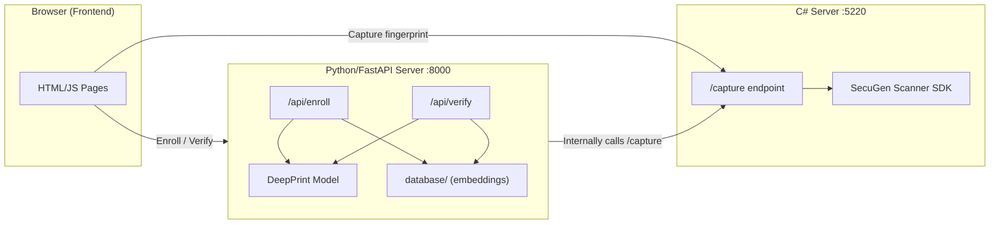
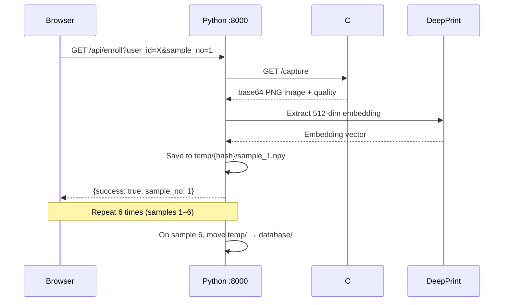
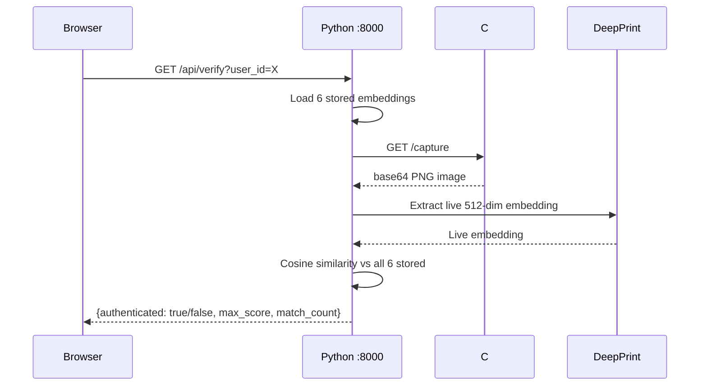

# Project Overview — Fingerprint Authentication System

This project is a **biometric fingerprint authentication system** that combines hardware-level fingerprint scanning with deep-learning-based verification. It uses a two-server architecture with a web frontend.

---

## High-Level Architecture

---

## Two Main Components

### 1. `fp_server/` — C# Fingerprint Scanner Server

| Aspect | Detail |
|--------|--------|
| **Framework** | ASP.NET Core 8.0 (Minimal API) |
| **Target** | `net8.0-windows`, x64 only |
| **Port** | `http://localhost:5220` |
| **Scanner SDK** | SecuGen FDx SDK Pro (`SecuGen.FDxSDKPro.DotNet.Windows.dll`) |

**Key file:** [Program.cs](./fp_server/Program.cs)

**What it does:**
- Initializes a **SecuGen USB fingerprint scanner** on startup (auto-detect)
- Exposes a single **`GET /capture`** endpoint that:
  1. Waits up to 3 seconds for a finger to be placed on the scanner
  2. Performs a **quality check** (rejects quality < 60)
  3. Converts the raw grayscale buffer to a **PNG bitmap**
  4. Returns the image as a **base64-encoded string** along with quality score
- Serves static frontend files from `wwwroot/`
- Auto-opens `enroll.html` in the browser on startup

**Stored Data:** `CapturedFingerprints/` — contains **~820 TIFF fingerprint images** organized by user ID (e.g., `19_1.tiff` through `19_10.tiff` means user 19, samples 1–10). Also has `temp_*.tiff` files used during testing.

---

### 2. `Group_type_A/fixed-length-fingerprint-extractors/` — Python AI Backend

| Aspect | Detail |
|--------|--------|
| **Framework** | FastAPI + Uvicorn |
| **Port** | `http://127.0.0.1:8000` |
| **ML Model** | DeepPrint (Texture + Minutiae branches) |
| **Embedding Size** | 512 dimensions (256 texture + 256 minutiae) |

**Key file:** [app.py](./Group_type_A/fixed-length-fingerprint-extractors/app.py)

This is based on the **[flx](./Group_type_A/fixed-length-fingerprint-extractors/README.md)** research package — a refactored codebase from the BIOSIG 2023 paper on fixed-length fingerprint representations using DeepPrint.

#### DeepPrint Model

The model architecture is defined in [deep_print_arch.py](./Group_type_A/fixed-length-fingerprint-extractors/flx/models/deep_print_arch.py):

- **InceptionV4 backbone** for feature extraction
- **Texture branch** → 256-dim embedding
- **Minutiae branch** → 256-dim embedding  
- Combined → **512-dim fixed-length representation**
- Input: 299×299 grayscale fingerprint images

**Note:** For privacy reasons, the model checkpoints (`.pyt` files) and raw fingerprint image datasets are not included in this repository. They can be provided upon request.

---

## Workflow

### Enrollment Flow (`/api/enroll`)

- Requires **6 fingerprint scans** per user
- Embeddings stored as `.npy` files in `temp/` during enrollment, moved to `database/` on completion
- User IDs are **SHA-256 hashed** for folder names
- Currently **1 enrolled user** in the database

### Verification Flow (`/api/verify`)

- Compares live scan against **all 6 enrolled embeddings** using **cosine similarity**
- Threshold: score ≥ **0.75** counts as a match
- Authentication requires: `match_count >= 4` (majority vote — 4 out of 6 stored samples must match)

---

## Frontend Pages

| Page | File | Purpose |
|------|------|---------|
| Landing | [index.html](./fp_server/wwwroot/index.html) | Dark-themed single-capture page (C# server's static files) |
| Enrollment | [enroll.html](./fp_server/wwwroot/enroll.html) | 6-scan enrollment loop (C# server) |
| Verify | [verify.html](./fp_server/wwwroot/verify.html) | Capture & verify (uses [app.js](./fp_server/wwwroot/app.js)) |
| Python Home | Inline in [app.py](./Group_type_A/fixed-length-fingerprint-extractors/app.py#L271-L318) | Landing page for FastAPI server |
| Python Enroll | [enroll.html](./Group_type_A/fixed-length-fingerprint-extractors/templates/enroll.html) | Template for Python enrollment |
| Python Verify | [verify.html](./Group_type_A/fixed-length-fingerprint-extractors/templates/verify.html) | Template for Python verification |

---

## Technology Stack Summary

| Layer | Technology |
|-------|-----------|
| Fingerprint Scanner | SecuGen USB (FDx SDK Pro) |
| Scanner Server | C# / ASP.NET Core 8.0 Minimal API |
| AI Backend | Python 3.9+ / FastAPI / PyTorch |
| ML Model | DeepPrint (InceptionV4 + Texture + Minutiae branches) |
| Frontend | Vanilla HTML/CSS/JS |
| Data Storage | `.npy` files on disk (SHA-256 hashed folder names) |
| Fingerprint Images | TIFF format (~100-140 KB each) |
